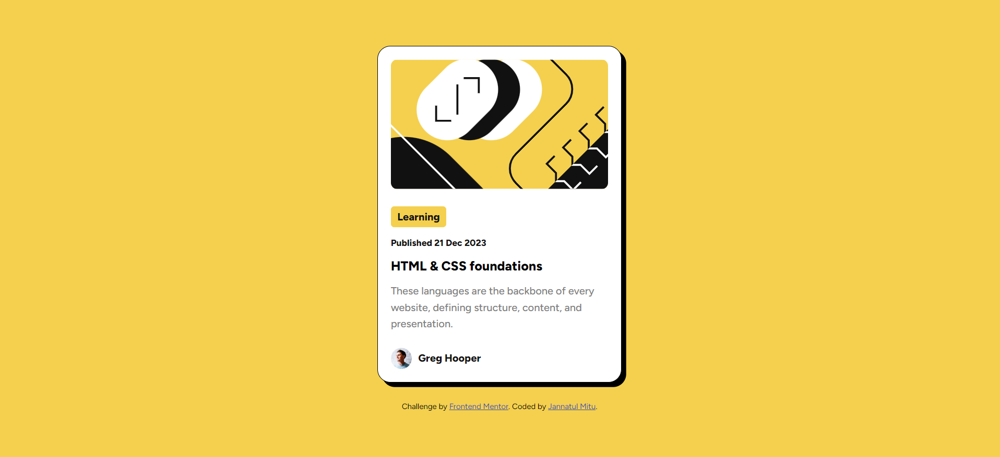
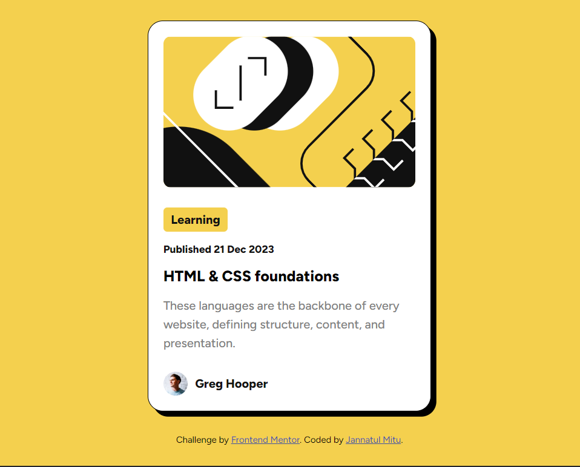
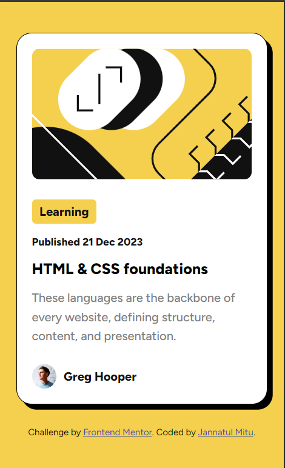

# Frontend Mentor - Blog preview card solution

This is a solution to the [Blog preview card challenge on Frontend Mentor](https://www.frontendmentor.io/challenges/blog-preview-card-ckPaj01IcS). Frontend Mentor challenges help you improve your coding skills by building realistic projects. 

## Table of contents

- [Overview](#overview)
  - [The challenge](#the-challenge)
  - [Screenshot](#screenshot)
  - [Links](#links)
- [My process](#my-process)
  - [Built with](#built-with)
  - [What I learned](#what-i-learned)
- [Author](#author)


## Overview

### The challenge

Users should be able to:

- See hover and focus states for all interactive elements on the page

### Screenshot

#### Desktop

#### Tablet

#### Mobile



### Links

- Solution URL: [My repository for Blog preview card](https://github.com/jannatulmitu03/blog-preview-card)
- Live Site URL: [My live url for Blog preview card](https://jannatulmitu03.github.io/blog-preview-card/)

## My process

### Built with

- Semantic HTML5 markup
- CSS custom properties
- Flexbox
- Desktop-first workflow


### What I learned

- Border-hover
*Similar responsive design for all the devices*


```css
.card-container:hover{
    box-shadow: 10px 10px 0px var(--Black);
    transition: all .3s ease;
}
```


## Author

- Website - [Jannatul Mitu](https://www.linkedin.com/in/jannatulmitu03)
- Frontend Mentor - [@jannatulmitu03](https://www.frontendmentor.io/profile/jannatulmitu03)
- Twitter - [@jannatulmitu03](https://twitter.com/jannatulmitu03)
